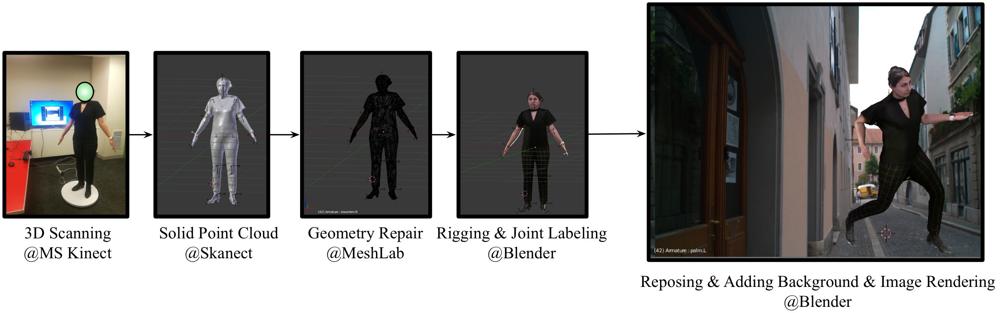
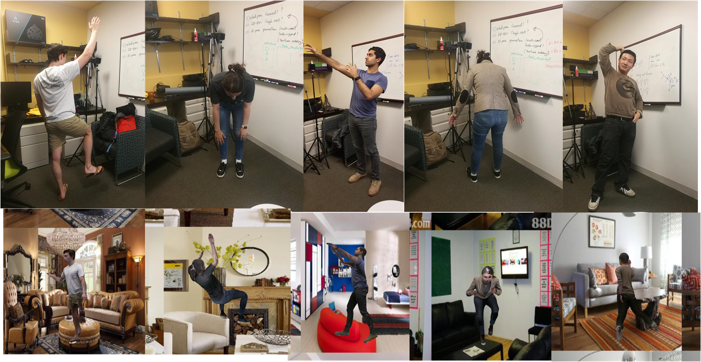
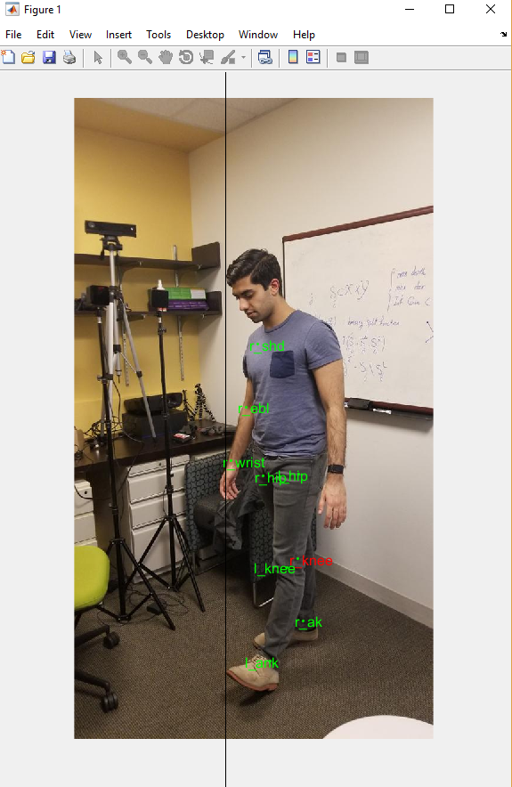
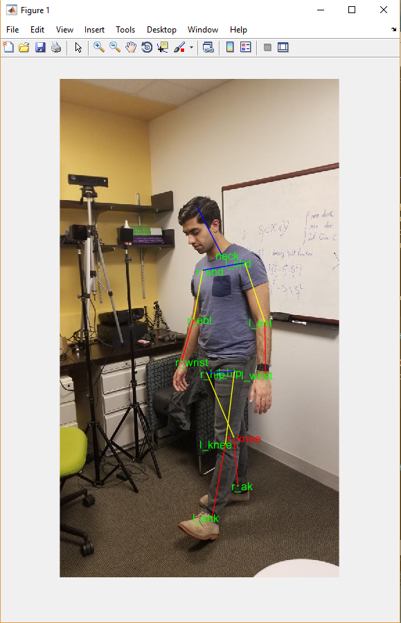

# ScanAva Generation Toolkit 

This is the code for the following paper:

Shangjun Liu, Sarah Ostadabbas,  [A Semi-Supervised Data Augmentation Approach using 3D Graphical Engines](https://arxiv.org/abs/1808.02595), ECCV 2018. 




Contact: 
[Shuangjun Liu](liu.shu@husk.neu.edu), [Sarah Ostadabbas](ostadabbas@gmail.com)

## Contents 
* [1. Requirement](#1-requirement)
* [2. Human Scan](#2-Human-scan)
* [3. Human rigging](#3-Human-rigging)
* [4. Dataset generation](#4-Dataset-generation)
* [5. Testing](#5-Train-and-test-human-pose-estimation-model)
* [Citation](#citation)
* [License](#license)

## 1. Requirement 
* Install [blender 2.79](https://www.blender.org/). Tested on 2.79, higher version should also work. 
* Install SciPy for blender python Interpreter. You can do this by install same version of python then copy the package to blender packages folder `blenderFd/python/lib/python3.2/site-packages`. Or you can point to the scipy py3.5 package path in the code. 

* DownLoad the [LSUN dataset](http://lsun.cs.princeton.edu/2017/), living room part. Set the folder path inside code `GenDataFromDesFunV4.py `. You can use any background jpg images for this. 
For example,  `'/home/jun/datasets/lsun/living_room_tr_img/'`

## 2. Human scan 
We employ the Kinect v1 for 3d with a rotator. You can use the device you like for the scan. 

## 3. Human rigging 
We provide a template in the code under samples. Open the blender file, delete the mesh but the skeleton. Import the scan you want. Fit the skeleton to the new pose. Then use the automatically weight functionality to rigging the skeleton to mesh. (Please refer to the blender totorial for rigging part)

## 4. Dataset generation 
Put the code and blender files in one folder if you use default relative path. 

"main.bash":
Edit ‘bldLs’ to include the blender files you wish to generate data-sets for. 

“execute.bash”
You can change the file being ran to either “genDescFromRRv3.py” or “genDescFromUni_v2.py”, depending on if you want the poses to come from RR or from uniform and independent random joint angles
“genDescFromRRv3.py” or “genDescFromUni_v2.py”: All necessary parameters to edit are in the “USER PARAMS” section at the top of the code. 

“blender_folder_path”: Set this to the location of the “augmentation_code” folder of yours i.e.: ‘/home/sehgal.n/augmentation_code’ 

“py35_package_path”: Set this to the location of the site packages for your py35 installation of miniconda (as discussed in previous section)
i.e.: ‘/home/sehgal.n/miniconda3/envs/py35/lib/python3.5/site-packages’
“degree”: Default is 0. You can also set degree=35 for the security camera viewpoint. 
“Npose”: Default is 2000. You can modify as desired. 

Default dataset is generated inside current folder. You can specify this by setting the `dsFd` parameters in `“genDescFromRRv3.py`

## 5. Train and test human pose estimation model
We test our generation method with state of art [hourglass](https://github.com/umich-vl/pose-hg-train) 2d human pose estimation model. 
If you want to train it, please download our generated [ScanAva](http://www.coe.neu.edu/Research/AClab/ScanAva/ScanAva.zip) dataset and test against our corresponding real world 2d image set [AC2d](http://www.coe.neu.edu/Research/AClab/ScanAva/AC2d.zip)

We provide [pretrained models](http://www.coe.neu.edu/Research/AClab/ScanAva/ScanAvaModel.zip) trained on seven people and also on single person without/with white noise or gaussian filter. 
For seven people version, we test it against the corresponding real 2d images of same persons we synthesize from. 

For single person version, we trained on synthetic people and test agains same people with clothes never appear in synthetic trainning set to test the generalization ability against specific person. 

We also provide test result from model trained by 10000 SURREAL samples and also the pretrained hg model provided by original work "umich-stacked-hourglass"

For adaptation version, the test set should be preprocessed by the same adaptation. For example, gaussian filter should be applied to test set when using model trained with gaussian filter. 

where wn stands for white noise, and gauFt stands for gaussian filter. 

In `final_preds.h5` file, the prediction result "preds", ground truth "joints_gt" and also the torso length 'lenTorso' are provided. So you can generate PCK from these data.   

## 6. Labeling Toolkit 
To build up corresponding real and synthetic corresponding datasets, we also provide a labeling toolkit conventional dataset generation which is located in folder labelTool/. 

First you need to collect your own images with conventional device such as smart phone or webcam then put them in a folder structure.  
For example:  

'datasetNm/images/xxx.jpg'

Then modify the corresponding data path, subfolder which contains images, if rotate angle for labeling, and image format  

`
dsFd = 'S:\ACLab\datasets_prep\ac2d_00_lbTest';
subFd = 'images'
angRt = 0; % clock wise 
imgFmt = 'jpg';
`

Then simply run the sc_labelImSet.m to label the dataset.
### labeling instructions  
The joint follow the sequence of (LSP dataset)[http://sam.johnson.io/research/lsp.html] as:

* Right ankle
* Right knee
* Right hip
* Left hip
* Left knee
* Left ankle
* Right wrist
* Right elbow
* Right shoulder
* Left shoulder
* Left elbow
* Left wrist
* Neck
* Head top

* left for visible, 
* right for invisible. 
* 'r' for redo last label 
* 'e' to end the session 
After each labeling, input 1 for continue, 2 for redo the current image. 

We also provides a auto saving mechanism that you can always continue from last checkpoints if interrupted during labeling process. You can also specify the starting and end index label selectively.  More detailed usage, please refer to function `LabelImSet.m`.  




## Citation 
If you use this code, please cite the following:
```
@article{liu2018semi,
  title={A Semi-Supervised Data Augmentation Approach using 3D Graphical Engines},
  author={Liu, Shuangjun and Ostadabbas, Sarah},
  journal={9th International Workshop on Human Behavior Understanding: at ECCV’18, arXiv preprint arXiv:1808.02595},
  year={2018}
}
```


## License 
* This code is for non-commertial purpose only. For other uses please contact ACLab of NEU. 
* No maintainence survice 


